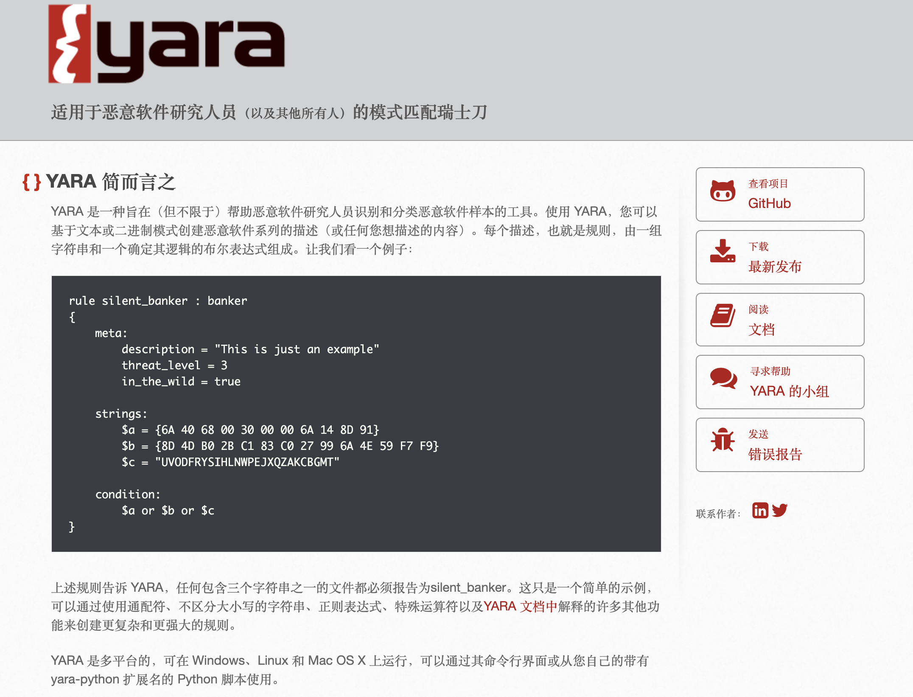
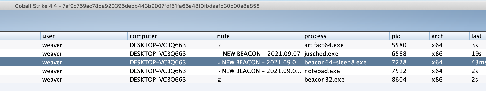
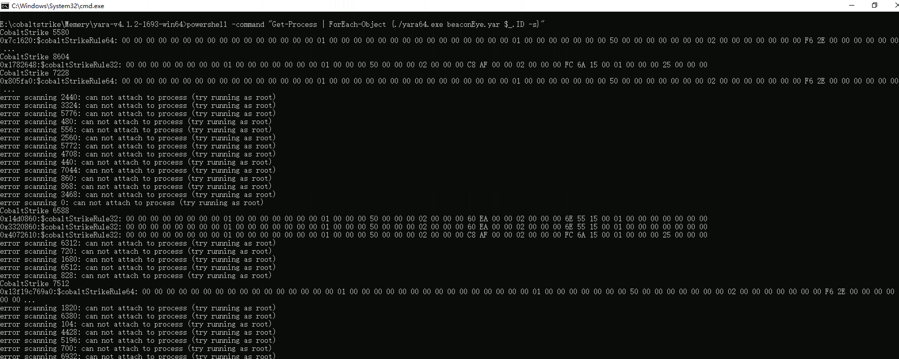

# cs_yara 
Check Cobalt Strike Yara Rules

#### 参考链接
https://github.com/CCob/BeaconEye

rule from https://raw.githubusercontent.com/CCob/BeaconEye/master/BeaconEye.cs

#### beaconEye.yar

```
rule CobaltStrike { 
  strings:  
    $cobaltStrikeRule64 = {  00 00 00 00 00 00 00 00 00 00 00 00 00 00 00 00  01 00 00 00 00 00 00 00 (00|01|02|04|08|10) 00 00 00 00 00 00 00  01 00 00 00 00 00 00 00 ?? ?? 00 00 00 00 00 00  02 00 00 00 00 00 00 00 ?? ?? ?? ?? 00 00 00 00  02 00 00 00 00 00 00 00 ?? ?? ?? ?? 00 00 00 00  01 00 00 00 00 00 00 00 ?? ?? 00 00 00 00 00 00 } 
    $cobaltStrikeRule32 = {  00 00 00 00 00 00 00 00  01 00 00 00 (00|01|02|04|08|10) 00 00 00 01 00 00 00 ?? ?? 00 00  02 00 00 00 ?? ?? ?? ??  02 00 00 00 ?? ?? ?? ??  01 00 00 00 ?? ?? 00 00 }
  condition: any of them
}

```

#### yara download

https://virustotal.github.io/yara/


https://github.com/virustotal/yara/releases/latest



## cs beacon




## powershell check
```
powershell -command "Get-Process | ForEach-Object {./yara64.exe beaconEye.yar $_.ID -s}"
```


